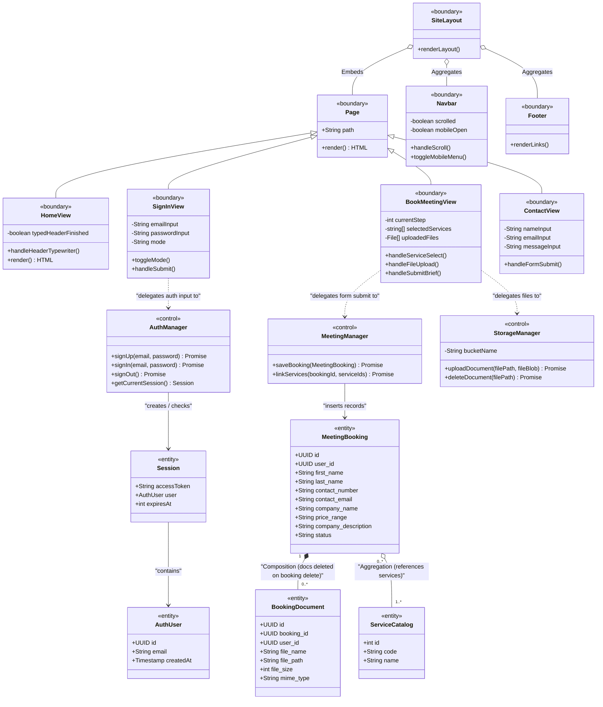
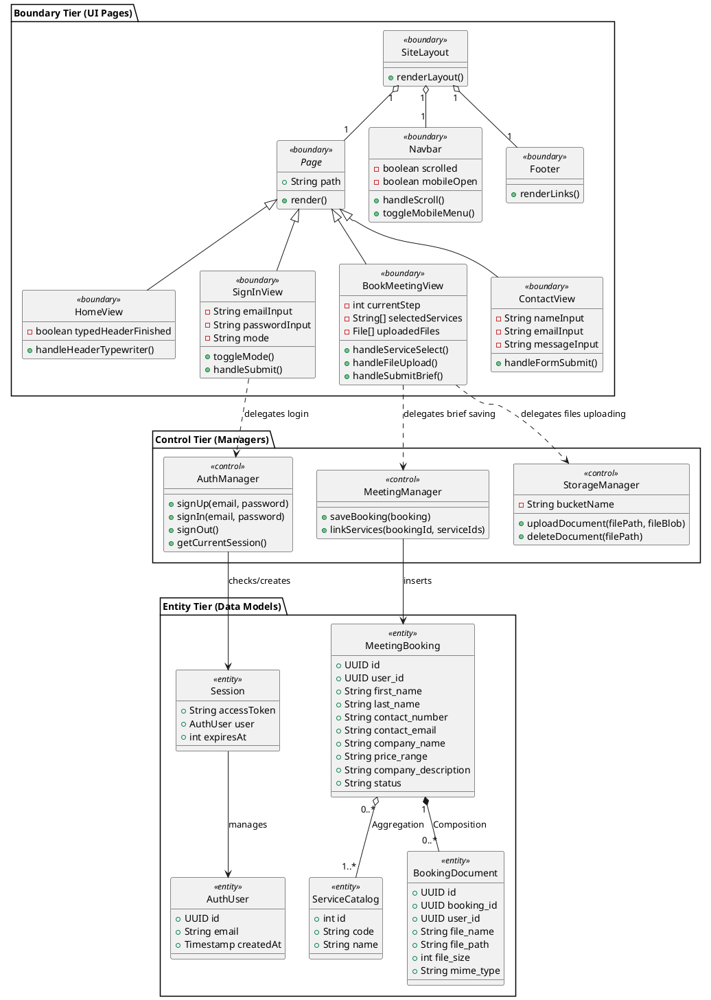

# Cortvex Class Diagram Specifications

This specification maps the Cortvex codebase architecture to a robust, three-tiered UML Class Diagram based on the **Model-View-Controller (MVC) / Entity-Control-Boundary (ECB)** pattern.

---

## 1. Architectural Stereotypes

Consistent with professional UML guidelines (as shown in your reference images), the class ecosystem is divided into:
1. **Boundary Classes (`<<boundary>>`)**: Interfaces that display output to the user and capture user inputs.
2. **Control Classes (`<<control>>`)**: Managers and handlers that drive user verification, file storage uploads, and database writes.
3. **Entity Classes (`<<entity>>`)**: Data models, schemas, and credentials saved persistently in database tables or session states.

---

## 2. Visual Class Diagram (Mermaid)

---

## 3. PlantUML Source Code

For PlantUML render engines:

