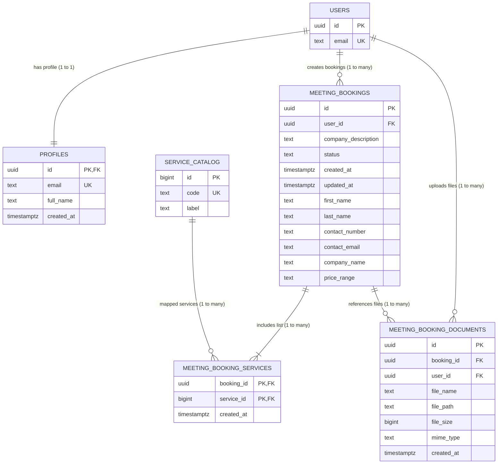

# Cortvex Entity Relationship Diagram (ERD)

This document contains the Entity Relationship Diagram (ERD) for the Cortvex database based on the provided Supabase/PostgreSQL schema.

---

## 1. ERD Visualization (Mermaid)



---

## 2. PlantUML ERD Code

For rendering database relations in PlantUML engines, you can use the code below:

```plantuml
@startuml
skinparam linetype ortho

' Entities
entity "auth.users" as users {
  * id : uuid <<PK>>
  --
  email : text
}

entity "public.profiles" as profiles {
  * id : uuid <<PK>> <<FK>>
  --
  email : text <<unique>>
  full_name : text
  created_at : timestamptz
}

entity "public.service_catalog" as catalog {
  * id : bigint <<PK>>
  --
  code : text <<unique>>
  label : text
}

entity "public.meeting_bookings" as bookings {
  * id : uuid <<PK>>
  --
  * user_id : uuid <<FK>>
  * company_description : text
  * status : text
  * created_at : timestamptz
  * updated_at : timestamptz
  * first_name : text
  * last_name : text
  * contact_number : text
  * contact_email : text
  * company_name : text
  * price_range : text
}

entity "public.meeting_booking_services" as services {
  * booking_id : uuid <<PK>> <<FK>>
  * service_id : bigint <<PK>> <<FK>>
  --
  * created_at : timestamptz
}

entity "public.meeting_booking_documents" as documents {
  * id : uuid <<PK>>
  --
  * booking_id : uuid <<FK>>
  * user_id : uuid <<FK>>
  * file_name : text
  * file_path : text
  file_size : bigint
  mime_type : text
  * created_at : timestamptz
}

' Relationships with explicit labels
users "1" -- "1" profiles : "has profile (1 to 1)"
users "1" -- "many" bookings : "creates bookings (1 to many)"
users "1" -- "many" documents : "uploads files (1 to many)"

bookings "1" -- "many" services : "includes list (1 to many)"
catalog "1" -- "many" services : "mapped services (1 to many)"
bookings "1" -- "many" documents : "references files (1 to many)"

@uml
```

---

## 3. Database Relationships & Constraints Summaries

- **Many to Many (M:N) Relationship**: The conceptual relationship between `meeting_bookings` and `service_catalog` is a **many to many** mapping. This is resolved physically using `meeting_booking_services` as a join table containing foreign keys matching both tables.
- **One to One (1:1) Relationship**: The user `profiles` table maps to the primary authentication table `auth.users` through a shared primary key `id`.
- **One to Many (1:N) Relationship**: A user creates **1 to many** bookings, and a booking references **1 to many** documents.
- **Field Constraints**:
  - `contact_email` enforces an `@` existence pattern matching check constraint.
  - `price_range` enforces enum arrays limits (`<2k`, `2k-5k`, `5k-15k`, `15k-50k`, `50k+`, `not_specified`).
