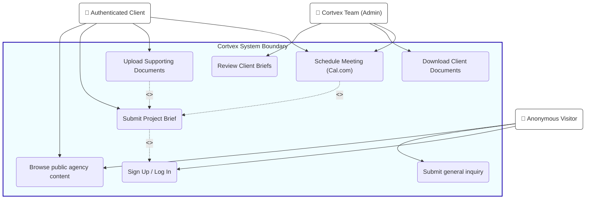
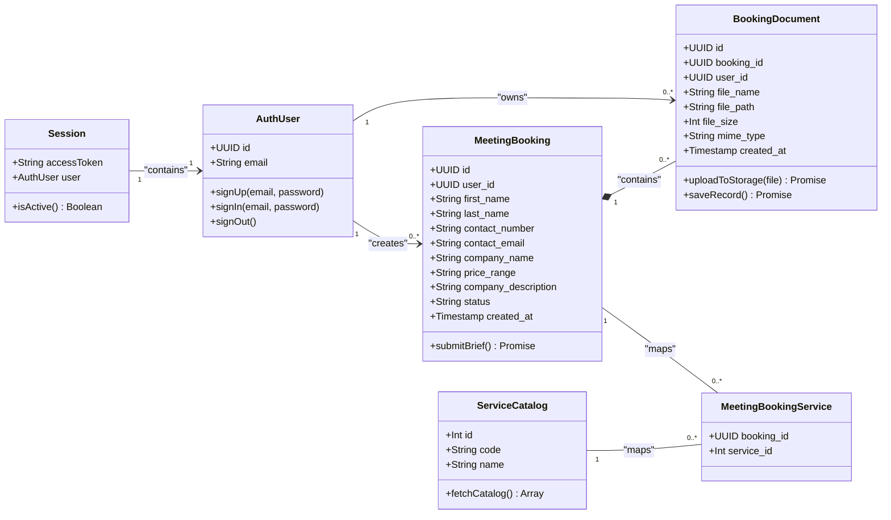

# Cortvex UML & Use Case Architecture

This document defines the **User Classes** (roles), the **UML Class Diagram** (domain models and database structure), and the **Use Case Diagram** (interactions) for the Cortvex application.

---

## 1. User Classes (Actors)

There are three primary user classes interacting with the Cortvex platform:

### A. Anonymous Visitor (Guest)
- **Description**: Public website visitors browsing the portfolio, services, or contact details.
- **Capabilities**:
  - View public agency content (Home, Services, Process, Work, Blog, FAQ).
  - Submit general messages or queries via the contact form.
  - Access login/registration forms to transition to a registered user.

### B. Authenticated Client (Registered User)
- **Description**: Clients who have created an account to book strategy consultations and submit product briefs.
- **Capabilities**:
  - Inherits all Guest privileges.
  - Submit detailed, structured meeting briefs (defining company, budget range, and selected services).
  - Upload supporting project documentation (PDFs, templates, pitch decks) securely to Supabase Storage.
  - Access the inline Cal.com booking scheduler.

### C. Cortvex Team Member (Admin / Developer)
- **Description**: Agency operators (Saif, Hassan, Umer, etc.) who review prospects and run meetings.
- **Capabilities**:
  - Access the Supabase Studio dashboard to review incoming `meeting_bookings`.
  - Download and inspect files in the `meeting-docs` storage bucket.
  - Manage scheduled calendar events on the Cal.com dashboard.

---

## 2. Use Case Diagram

The use case diagram outlines how the actors interact with the system boundary (Cortvex App + Supabase + Cal.com).

---

## 3. Domain Class Diagram

This diagram displays the structural classes, database models, and their relationships. It represents the objects parsed by the front-end (using Supabase JS schema representations) and their mappings in the database.

### Class Attributes & Methods Details:
1. **`AuthUser`**: Maps to Supabase Auth (`supabase.auth`). Manages credential actions.
2. **`Session`**: Front-end session manager checking if a user has access tokens. Used by route guards.
3. **`MeetingBooking`**: The client profile brief submitted before booking. Represents the database table `meeting_bookings`.
4. **`BookingDocument`**: Manages document files uploaded by the client. Links physical files in Supabase Storage (`meeting-docs` bucket) to metadata database logs (`meeting_booking_documents` table).
5. **`ServiceCatalog`**: Holds static listings of offered services (e.g., `web_development`, `ai_automation`) mapped from `service_catalog`.
6. **`MeetingBookingService`**: Join table matching selected services to bookings, mapping to `meeting_booking_services` table.
