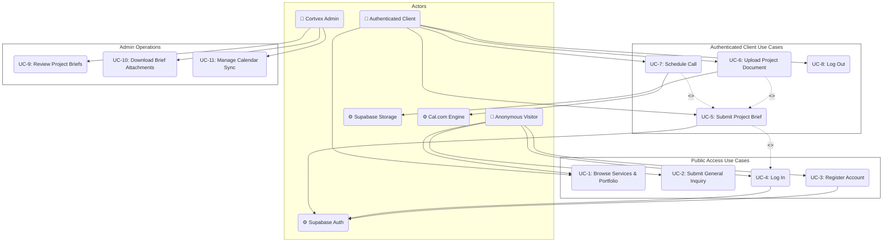
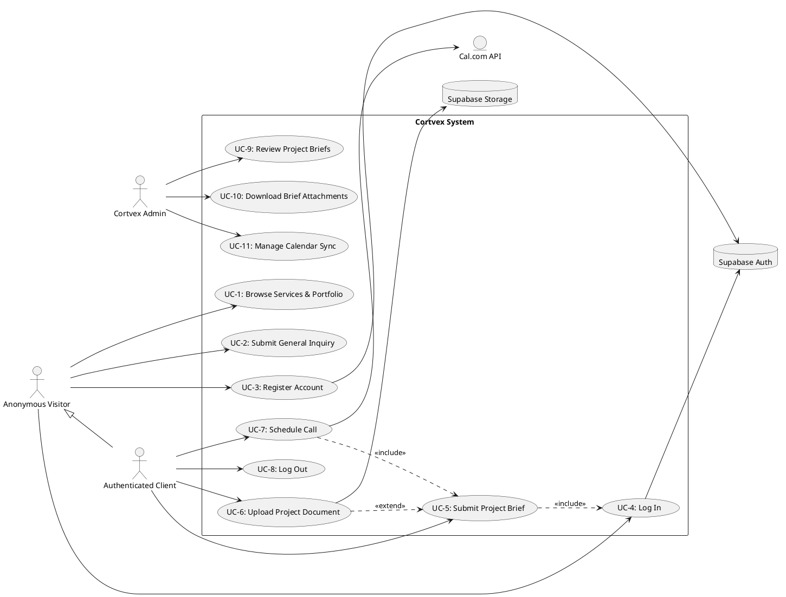

# Cortvex Full Use Case Specifications

This document provides a comprehensive Use Case Specification for the Cortvex application, including detailed Use Case Diagram syntax (Mermaid & PlantUML) and textual specifications for each use case.

---

## 1. Actors Definition

### A. Primary Actors
1. **Anonymous Visitor (Guest)**: Unauthenticated end-user browsing the website.
2. **Authenticated Client (Registered User)**: Logged-in customer seeking services and bookings.
3. **Cortvex Team Member (Admin)**: Agency operators managing bookings and reviewing briefs.

### B. Secondary / Supporting Actors (External Systems)
4. **Supabase Auth Service**: Handles credential verification and session tokens.
5. **Supabase Storage Service**: Hosts files uploaded by users.
6. **Cal.com API**: Handles inline meeting scheduler scheduling and calendar sync.

---

## 2. Visual Use Case Diagram

Here is the full Use Case Diagram represented in **Mermaid.js** syntax:

---

## 3. PlantUML Source Code

If you prefer to render diagrams via PlantUML, you can copy-paste the code below:

---

## 4. Use Case Specifications Narratives

Below are specifications for the primary user actions:

### UC-5: Submit Project Brief
- **Actor**: Authenticated Client
- **Description**: Allows authenticated clients to input information regarding their company profile, budget estimation, and desired services checklist.
- **Preconditions**: User must be registered and authenticated (Session active).
- **Postconditions**: Brief is saved in `meeting_bookings` and selected services mapped in `meeting_booking_services`.
- **Main Flow**:
  1. Client navigates to the booking interface `/book-meeting`.
  2. System checks user session via `Supabase Auth`. (If invalid, redirects to Log In).
  3. Client inputs first name, last name, phone, company name, company description, budget range.
  4. Client selects one or more checkboxes corresponding to requested services.
  5. Client clicks "Submit Meeting Brief".
  6. System saves records to the Supabase database.
  7. System renders confirmation alert and proceeds to booking schedule calendar loader (UC-7).

### UC-6: Upload Project Document
- **Actor**: Authenticated Client
- **Description**: Enables users to attach files to support their meeting brief.
- **Preconditions**: Client is currently filling out a Project Brief (UC-5).
- **Postconditions**: Files are uploaded to Supabase Storage, metadata records are logged in `meeting_booking_documents`.
- **Main Flow**:
  1. While filling the brief form, client clicks "Upload documents".
  2. Client selects document files from local filesystem (PDF, DOCX, TXT, etc.).
  3. System validates file duplicates and renders files list.
  4. Client clicks "Submit Meeting Brief".
  5. System uploads files to Supabase Storage Bucket `meeting-docs` under `${user_id}/${booking_id}/`.
  6. System logs file metadata (filepath, size, name) in `meeting_booking_documents`.

### UC-7: Schedule Call
- **Actor**: Authenticated Client, Cal.com API
- **Description**: Integrates the Cal.com scheduling calendar widget to reserve a time slot.
- **Preconditions**: Client has completed the Project Brief submission (UC-5).
- **Postconditions**: Calendar slot reserved on Cal.com and synced to Cortvex operators.
- **Main Flow**:
  1. System loads the Cal.com embed widget inside the `/book-meeting` page.
  2. System pre-populates Client Name and Email inside the scheduler context.
  3. Client selects an available time slot and completes scheduler reservation.
  4. Cal.com syncs invitation emails to client and Cortvex calendar.
